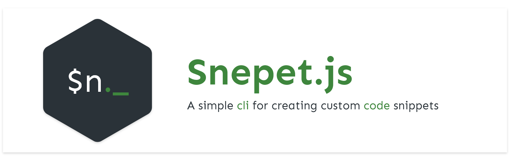
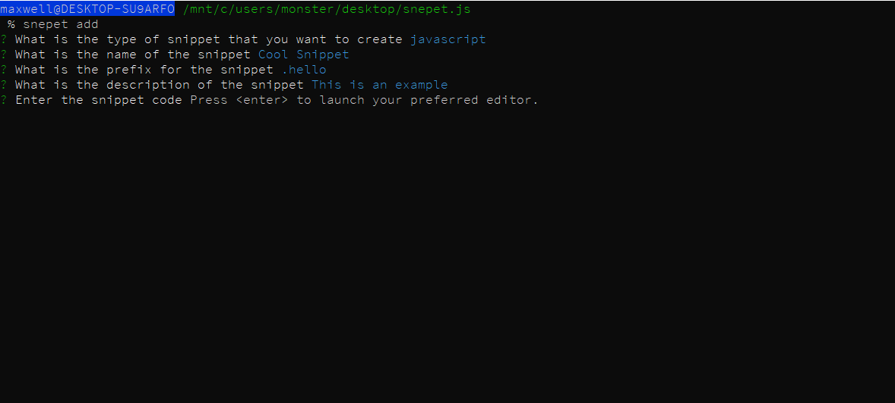
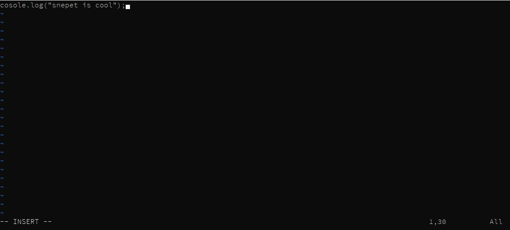
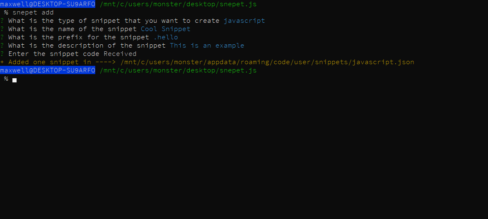
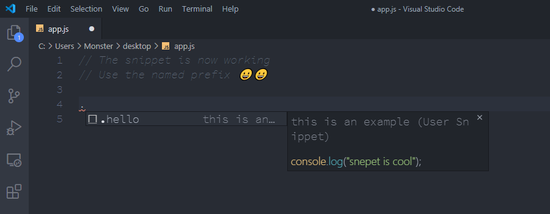

# **Snepet.js**



snepet is a cli tool for creating custom snippets for vscode for any language or any vscode-supported type

## **🔻 Installation**

```bash
    npm install -g snepet
```

## **❓ How to use**

- **Step One 1️⃣ - Add new Snippet**

  To add a new snippet run 👇

  ```bash
  snepet add
  ```

- **Step Two 2️⃣ - Get all snippets**

  To get all the custom snippets for a given type - _language_ run 👇

  ```bash
  snepet get --type <snippet-type>
  ```

- **Step Three 3️⃣ - Delete a snepet**

  To delete a custom snippet, first run `snepet get` to get the snippets,then run 👇

  ```bash
  snepet delete --type <snippet-type> -id <snippet-id>
  ```

## **Commands**

| Command                                                         | Use                                                 |
| --------------------------------------------------------------- | --------------------------------------------------- |
| `snepet add`                                                    | Adds a new snippet                                  |
| `snepet get --type <snippet-type>`                              | Gets all the snippets for the type `<snippet-type>` |
| `snepet delete --snippet-id <snippet-id> --type <snippet-type>` | Deletes the specified snippet                       |

## **Example**

To create a `javascript` sample snippet for the snippet 👇

```js
console.log("snepet is cool");
```

- run 👇 to create a new snippet

```bash
  snepet add
```

- set the type to `javascript`
- set the name to `Cool Snippet`
- set the prefix to `.hello`
- set the description to `This is an example`
- Press enter and write the code `console.log('snepet is cool')`





- Now in vscode open a `javascript` file and start typing `.hello`. IT WORKS !!!



## **Supported Types**

```json
({
  "type": "Azure Resource Management Template",
  "file": "arm-template"
},
{
  "type": "azcli",
  "file": "azcli"
},
{
  "type": "Batch",
  "file": "bat"
},
{
  "type": "C",
  "file": "c"
},
{
  "type": "Clojure",
  "file": "clojure"
},
{
  "type": "C#",
  "file": "csharp"
},
{
  "type": "Diff",
  "file": "diff"
},
{
  "type": "Docker",
  "file": "docker"
},
{
  "type": "Env",
  "file": "dotenv"
},
{
  "type": "F#",
  "file": "fsharp"
},
{
  "type": "Git commit message",
  "file": "git-commit"
},
{
  "type": "Git rebase message",
  "file": "git-rebase"
},
{
  "type": "Go",
  "file": "go"
},
{
  "type": "Groovy",
  "file": "groovy"
},
{
  "type": "Handlebars",
  "file": "handlebars"
},
{
  "type": "HLSL",
  "file": "hlsl"
},
{
  "type": "Hosts",
  "file": "hosts"
},
{
  "type": "Git ignore",
  "file": "ignore"
},
{
  "type": "Ini",
  "file": "ini"
},
{
  "type": "Pug",
  "file": "jade"
},
{
  "type": "Javascript React",
  "file": "javascriptreact"
},
{
  "type": "JSON with comments",
  "file": "jsonc"
},
{
  "type": "VMOptions",
  "file": "jvmoptions"
},
{
  "type": "LESS",
  "file": "less"
},
{
  "type": "Log",
  "file": "log"
},
{
  "type": "Log",
  "file": "Log"
},
{
  "type": "Makefile",
  "file": "makefile"
},
{
  "type": "Markdown",
  "file": "markdown"
},
{
  "type": "Object C",
  "file": "object-c"
},
{
  "type": "Objective C++",
  "file": "objective-cpp"
},
{
  "type": "Perl",
  "file": "perl"
},
{
  "type": "Perl6",
  "file": "perl6"
},
{
  "type": "PHP",
  "file": "php"
},
{
  "type": "PlainText",
  "file": "plaintext"
},
{
  "type": "Powershell",
  "file": "powershell"
},
{
  "type": "Properties",
  "file": "properties"
},
{
  "type": "Python",
  "file": "python"
},
{
  "type": "R",
  "file": "r"
},
{
  "type": "Razor",
  "file": "razor"
},
{
  "type": "Ruby",
  "file": "ruby"
},
{
  "type": "Rust",
  "file": "rust"
},
{
  "type": "scminput",
  "file": "scminput"
},
{
  "type": "scss",
  "file": "scss"
},
{
  "type": "Search Result",
  "file": "search-result"
},
{
  "type": "ShaderLab",
  "file": "shaderlab"
},
{
  "type": "Shell Script",
  "file": "shellscript"
},
{
  "type": "SQL",
  "file": "sql"
},
{
  "type": "Swift",
  "file": "swift"
},
{
  "type": "Typescript",
  "file": "typescript"
},
{
  "type": "Typescript React",
  "file": "typescriptreact"
},
{
  "type": "Visual Basic",
  "file": "vb"
},
{
  "type": "XML",
  "file": "xml"
},
{
  "type": "XSL",
  "file": "xsl"
},
{
  "type": "YAML",
  "file": "yaml"
},
{
  "type": "C++",
  "file": "cpp"
},
{
  "type": "HTML",
  "file": "html"
},
{
  "type": "Java",
  "file": "java"
},
{
  "type": "Javascript",
  "file": "javascript"
},
{
  "type": "Json",
  "file": "json"
},
{
  "type": "Vue",
  "file": "vue"
})
```

## **💡 Tips**

- To learn more about creating vscode snippets visit [web](https://code.visualstudio.com/docs/editor/userdefinedsnippets)

- You can escape `$` by using `\\` [web](https://stackoverflow.com/questions/42669459/vs-code-snippet-escape-file)

## **👂 Feedback**

- If you have any feedback or have any suggestions email me @ maxymashar@gmail.com
- If you want to contribute
  - Fork snepet.js from github
  - Make changes
  - Create a pull request
  - Thank you 😁
